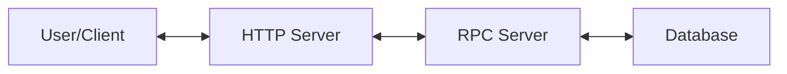

# TikTok Tech Immersion Program Assignment 2023

This is the backend assignment for the 2023 TikTok Tech Immersion Program. It is about creating an Instant Messaging System using Golang, Protobuf, Kitex, Redis and Docker. Only the backend is required for this assignment, frontend is not required.

## Setup Instructions

1. Clone the repository [here](https://github.com/melvincwng/tiktok_assignment_demo_2023) using this command:

   > `git clone https://github.com/melvincwng/tiktok_assignment_demo_2023.git --config core.autocrlf=false`.

2. The flag `--config core.autocrlf=false` is to ensure that the line endings are in **Unix format (LF)** and **not Windows format (CRLF)**. This is to ensure that the bash scripts can be executed properly. If this is not done, you will encounter issues regarding `/usr/bin/env: ‘bash\r’: No such file or directory` when running `docker-compose up` later on.

3. Next, download [Go](https://go.dev/doc/install).

4. Next, download [Docker Desktop](https://www.docker.com/products/docker-desktop/).

5. Run the command `docker-compose up` in the root directory of the project.

6. For Windows Users:

   - After executing `docker-compose up`, you may still encounter issues regarding `build.sh not found` despite the file being present in the directory.
   - This is because the line endings **are not** in Unix format (LF).
   - Bash scripts are **sensitive** to line endings formatting (can read up on LF vs CRLF).
   - To fix this, on your code editor e.g. VSCode, `click on the CRLF button at the bottom right corner and change it to LF`.
   - Then, run `docker-compose up` again. It should work now.
   - You can change your settings back to CRLF after you are done.
   - See **References 1 and 2 below** for more information.

7. Go to Docker Desktop and you should now see your containers running over there. There should be 3 containers running - http-server, rpc-server, etcd-container.

8. To test whether the initial APIs are working, we will be using Postman:
   - GET request
   - URL: localhost:8080/ping
   - If successful, you will see `200 OK` and a `{ message: pong }` in Postman.

## System Architecture

This is a simple system architecture diagram of the backend assignment:

## To Do's

After analyzing the assignment's requirements, it seems like majority of the server side code has already been implemented. The only things left to do are:

- [x] Setup Database and establish connection with the RPC Server. Once this is setup, we will have 4 containers running - http-server, rpc-server, etcd-container, db-container.
- [x] Update the business logic in handler.go - instead of using the placeholder areYouLucky(), we will be implementing our own logic here to a) send message and b) pull messages to/from the database.
- [x] Manual Testing via Postman/Unit Testing/Tidy up README.md
- [x] Everytime changes are made to the code, we will need to rebuild the docker image via `docker-compose build` and then re-run the containers via `docker-compose up`. Or else, the changes will not be reflected.

## Tech Stack Used

- Postman (Client)
- Hertz framework (using Protobuf protocol) for HTTP-server
- Kitex framework (to handle RPC calls) for RPC-server
- Redis for database
- Docker for containerization
- Go for backend code logic

## Screenshots

## References

How to resolve CRLF/LF line endings related issues for Windows users:

1. https://willi.am/blog/2016/08/11/docker-for-windows-dealing-with-windows-line-endings/
2. https://stackoverflow.com/questions/39527571/are-shell-scripts-sensitive-to-encoding-and-line-endings

Docker commands:

3. https://docs.docker.com/engine/reference/commandline/compose_build/
